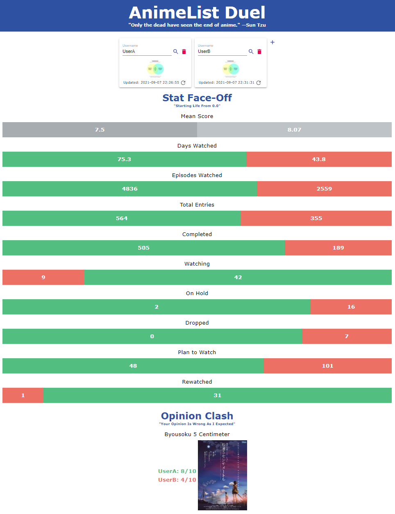

# animelist-duel

A website that compares the stats of two MyAnimeList users.

## Info:

The frontend website uses HTML, CSS and React. The backend is composed of a Node.js application and a MySQL database. The backend scrapes various MyAnimeList pages for data. In addition to being sent back to the frontend, the data is stored in a database to speed up future requests.

The website is meant to function with both the Node.js backend and the MySQL database running, though it still functions without the database.

The React portion was coded with JSX syntax. Running 'frontend/js/jsx_src/jsx_preprocessor.bat' in the background will automatically convert it.

'backend/fake_profiles.js' contains queries to add and remove fake profiles 'fakeuser1' and 'fakeuser2'. This can be used for testing or for showcasing the website without having to use data from real users.

