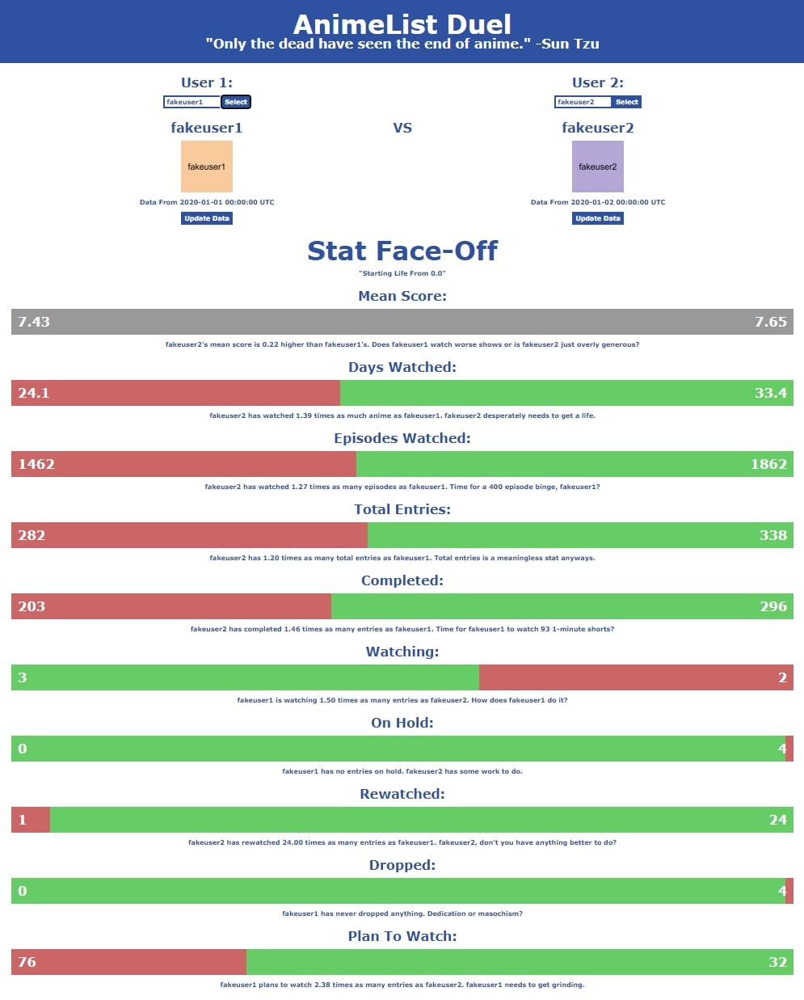

# animelist-duel

A website that compares the stats of two MyAnimeList users.

## Info:

The frontend website uses HTML, CSS and React. The backend is composed of a Node.js application and a MySQL database. The database stores past requests to speed up future ones. If the user is not in the database, the backend scrapes the MyAnimeList profile page of the user for data.

The website is meant to function with both the Node.js backend and the MySQL database running, though it functions without the database.

The React portion was coded with JSX syntax. Running frontend/js/jsx_src/jsx_preprocessor.bat in the background will automatically convert it.

